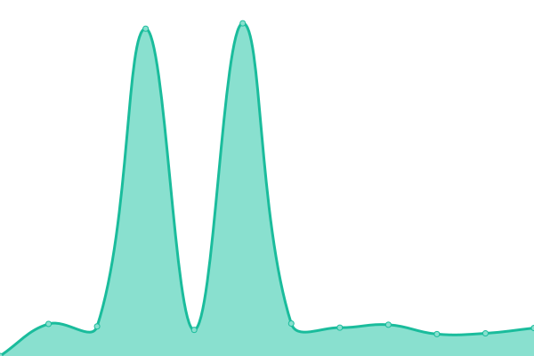

# [📈 Live Status](https://status.deuchnord.fr): <!--live status--> **🟩 All systems operational**

This repository contains the open-source uptime monitor and status page for [Jérôme Deuchnord](https://deuchnord.fr), powered by [Upptime](https://github.com/upptime/upptime).

With [Upptime](https://upptime.js.org), you can get your own unlimited and free uptime monitor and status page, powered entirely by a GitHub repository. We use [Issues](https://github.com/Deuchnord/uptime/issues) as incident reports, [Actions](https://github.com/Deuchnord/uptime/actions) as uptime monitors, and [Pages](https://status.deuchnord.fr) for the status page.

<!--start: status pages-->
<!-- This summary is generated by Upptime (https://github.com/upptime/upptime) -->
<!-- Do not edit this manually, your changes will be overwritten -->
<!-- prettier-ignore -->
| URL | Status | History | Response Time | Uptime |
| --- | ------ | ------- | ------------- | ------ |
|  [deuchnord.fr](https://deuchnord.fr) | 🟩 Up | [deuchnord-fr.yml](https://github.com/Deuchnord/uptime/commits/HEAD/history/deuchnord-fr.yml) | 

 597ms
     
 | 

<a href="https://status.deuchnord.fr/history/deuchnord-fr">99.06%</a>
    

|  [ActivityPub on deuchnord.fr](https://deuchnord.fr/.well-known/webfinger?resource=acct:blog@deuchnord.fr) | 🟩 Up | [activity-pub-on-deuchnord-fr.yml](https://github.com/Deuchnord/uptime/commits/HEAD/history/activity-pub-on-deuchnord-fr.yml) | 

 103ms
     
 | 

<a href="https://status.deuchnord.fr/history/activity-pub-on-deuchnord-fr">99.06%</a>
    

|  [DeuchTech](https://tech.deuchnord.fr) | 🟩 Up | [deuch-tech.yml](https://github.com/Deuchnord/uptime/commits/HEAD/history/deuch-tech.yml) | 

 1243ms
     
 | 

<a href="https://status.deuchnord.fr/history/deuch-tech">99.07%</a>
    

|  [Kosmorro's website](https://kosmorro.space) | 🟩 Up | [kosmorro-s-website.yml](https://github.com/Deuchnord/uptime/commits/HEAD/history/kosmorro-s-website.yml) | 

 851ms
     
 | 

<a href="https://status.deuchnord.fr/history/kosmorro-s-website">100.00%</a>
    

|  [Privatebin](https://paste.deuchnord.fr) | 🟩 Up | [privatebin.yml](https://github.com/Deuchnord/uptime/commits/HEAD/history/privatebin.yml) | 

 910ms
     
 | 

<a href="https://status.deuchnord.fr/history/privatebin">99.14%</a>
    

|  [LUFi](https://drop.deuchnord.fr) | 🟩 Up | [lu-fi.yml](https://github.com/Deuchnord/uptime/commits/HEAD/history/lu-fi.yml) | 

 1195ms
     
 | 

<a href="https://status.deuchnord.fr/history/lu-fi">99.14%</a>
    

<!--end: status pages-->

[**Visit our status website →**](https://status.deuchnord.fr)

## 📄 License

- Powered by: [Upptime](https://github.com/upptime/upptime)
- Code: [MIT](./LICENSE) © [Jérôme Deuchnord](https://deuchnord.fr)
- Data in the `./history` directory: [Open Database License](https://opendatacommons.org/licenses/odbl/1-0/)
